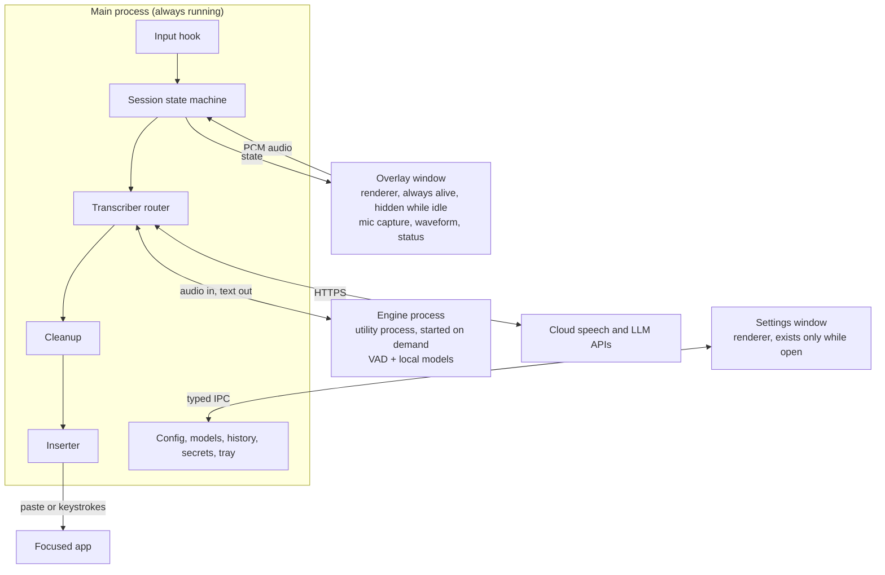
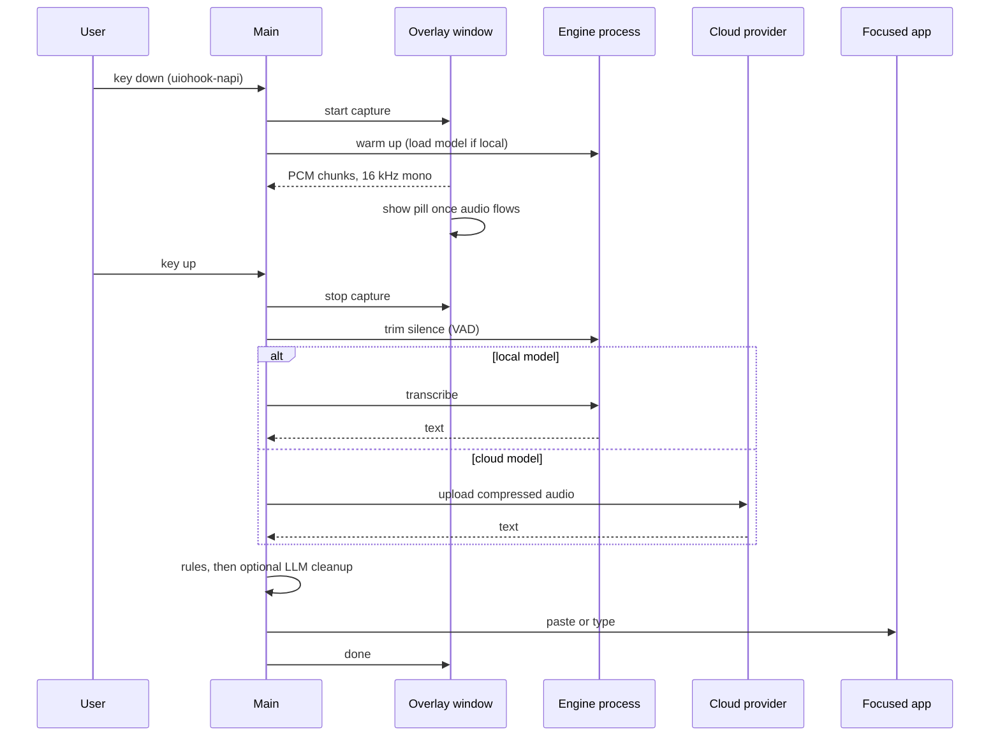

# Flow — Architecture

As of 2026-10-03. Companion to [SPEC.md](SPEC.md), which covers product behaviour, the model catalog and milestones.

Flow is an Electron app written in TypeScript. The main process runs the dictation path. Speech recognition runs outside it, either in a local engine process or at a cloud provider, so swapping a model changes only the transcriber.

## Stack

| Layer | Choice | Why |
| --- | --- | --- |
| App shell | Electron | One language for the whole app; mature tooling for windows, tray and updates |
| Language | TypeScript, strict mode, in every process | Shared types across main, engine, preload and renderers |
| Build | electron-vite | Separate bundles for main, preload and renderers with hot reload |
| Packaging | electron-builder, NSIS installer | Standard Electron toolchain; produces a signed Windows installer |
| Updates | `electron-updater` from GitHub Releases | Fits an MIT open-source project; no update server to run |
| Settings UI | React, Tailwind CSS, Radix UI primitives | Accessible components; window is created when opened and destroyed when closed |
| Overlay | Frameless, transparent, always-on-top `BrowserWindow` that never takes focus | Created at launch and kept hidden so it appears instantly; also hosts microphone capture |
| Hotkeys | [uiohook-napi](https://github.com/SnosMe/uiohook-napi) | Global key-down, key-up and mouse events. Electron's own [globalShortcut](https://www.electronjs.org/docs/latest/api/global-shortcut) fires only on press, so it cannot do hold-to-talk |
| Audio capture | Chromium `getUserMedia` with an AudioWorklet, in the overlay window | No native audio module; outputs 16 kHz mono |
| Voice detection | Silero VAD, in the engine process | Small and accurate; standard for trimming silence |
| Local inference | [transcribe.cpp](https://github.com/handy-computer/transcribe.cpp) through its TypeScript bindings, in an Electron [utility process](https://www.electronjs.org/docs/latest/api/utility-process) | One MIT runtime for 16 model families with CUDA and Vulkan; an engine crash cannot take down the app |
| Cloud inference | Built-in `fetch`, one adapter per provider | All adapters implement the same `Transcriber` interface as the local engine |
| Text insertion | Electron `clipboard` plus a simulated `Ctrl+V` from uiohook-napi; Win32 `SendInput` through `koffi` for the type method | Paste needs no extra dependency; typing needs direct Win32 calls |
| Focused-app detection | Win32 calls through `koffi` | Process name and window title for per-app profiles |
| Config | TOML parsed with `smol-toml`, validated with `zod`, watched with `chokidar` | Typed, validated settings with hot reload |
| Secrets | Electron [safeStorage](https://www.electronjs.org/docs/latest/api/safe-storage) | Encrypts API keys with Windows DPAPI |
| History | SQLite through `better-sqlite3` | Fast local search; no server |
| Tests | Vitest for units, Playwright for the packaged app | Covers pure logic and real windows |
| Tooling | pnpm, ESLint, Prettier, GitHub Actions | Reproducible installs and CI releases |

Versions are pinned in M0, when the native modules are first built against a specific Electron release.

## Process model

Four processes, of which two run while idle.



| Process | Type | Lifetime | Owns |
| --- | --- | --- | --- |
| Main | Electron main (Node.js) | App lifetime | Tray, input hook, session state, config, model manager, cloud calls, cleanup, insertion, history, secrets |
| Overlay | Renderer, sandboxed | App lifetime; hidden while idle | Microphone capture, resampling to 16 kHz mono, waveform, status pill |
| Engine | Utility process | Starts on the first dictation; exits after the idle timeout | Silero VAD, transcribe.cpp, loaded model memory |
| Settings | Renderer, sandboxed | Created on open, destroyed on close | React settings app |

Why the engine is a separate process:

- A native crash or out-of-memory in inference cannot take down the tray app. The main process restarts the engine on the next dictation.
- Unloading a model is a process exit, which returns all its memory to the system.
- Inference never blocks the main process, so hotkeys and the overlay stay responsive.

## Dictation data flow



The session is a state machine in the main process: `Idle → Recording → Transcribing → Inserting → Idle`, with `Cancel` available from `Recording` and `Transcribing`. A new recording can start while an earlier one is transcribing; results are inserted in order.

## The Transcriber interface

Every model, local or cloud, is reached through one interface. Adding a provider means adding one adapter file and one catalog entry.

```ts
export interface Transcriber {
  readonly id: string;
  /** Local models load here; cloud adapters omit it. */
  load?(signal: AbortSignal): Promise<void>;
  transcribe(audio: Float32Array, opts: TranscribeOptions): Promise<Transcript>;
  unload?(): Promise<void>;
}

export interface TranscribeOptions {
  language: string;          // "en" in v1
  hints: string[];           // dictionary terms, used where the model supports biasing
  signal: AbortSignal;       // cancel on Esc
}

export interface Transcript {
  text: string;
  model: string;
  audioMs: number;
  elapsedMs: number;
}
```

- **Local adapter:** a thin client in the main process that forwards calls to the engine process over a `MessagePort`.
- **Cloud adapters:** Groq, OpenAI, Mistral, ElevenLabs, Deepgram, plus a generic OpenAI-compatible adapter for custom endpoints.
- **Cleanup models** use a second, similar interface over OpenAI-compatible chat endpoints.

## IPC

Renderers never get Node.js access. Each window has a preload script that exposes a small typed API through `contextBridge`; channel names and payload types live in `src/shared/ipc.ts` and are validated with `zod` on the main side.

| Channel | Direction | Payload |
| --- | --- | --- |
| `capture:start`, `capture:stop` | Main → Overlay | Device ID, sample rate |
| `capture:chunk` | Overlay → Main | `Float32Array` PCM |
| `capture:error` | Overlay → Main | Reason (device missing, permission, busy) |
| `overlay:state` | Main → Overlay | `listening`, `transcribing`, `done`, `error`, plus a cloud flag |
| `engine:load`, `engine:transcribe`, `engine:trim`, `engine:unload` | Main ↔ Engine | Model ID, audio, options; text or error back |
| `config:get`, `config:set`, `config:changed` | Settings ↔ Main | Validated config, or a patch |
| `models:list`, `models:download`, `models:progress`, `models:activate` | Settings ↔ Main | Catalog entries, progress |
| `secrets:set`, `secrets:has` | Settings → Main | Provider ID and key; keys are never sent back to a renderer |
| `bench:run`, `bench:result` | Settings ↔ Main | Recorded sample, model IDs; text, latency and cost per model |

## Repository layout

```text
flow/
├─ src/
│  ├─ main/                 Electron main process
│  │  ├─ index.ts           App startup, single-instance lock, tray
│  │  ├─ session/           Dictation state machine and queue
│  │  ├─ input/             uiohook-napi hook, binding matcher, double-tap
│  │  ├─ transcribe/        Transcriber interface, cloud adapters, engine client
│  │  ├─ cleanup/           Dictionary, snippets, spoken formatting, LLM pass
│  │  ├─ insert/            Clipboard paste, SendInput typing
│  │  ├─ profiles/          Focused-app detection and per-app overrides
│  │  ├─ config/            TOML load and patch, zod schema, watcher, migrations
│  │  ├─ models/            Catalog manifest, downloads, checksums, memory policy
│  │  ├─ history/           better-sqlite3 store
│  │  ├─ secrets/           safeStorage wrapper
│  │  ├─ windows/           Overlay, settings and tray management
│  │  └─ platform/          Win32 calls through koffi, behind an interface
│  ├─ engine/               Utility process: VAD and transcribe.cpp
│  ├─ preload/              contextBridge APIs for overlay and settings
│  ├─ renderer/
│  │  ├─ overlay/           Capture worklet, waveform, status pill
│  │  └─ settings/          React app
│  └─ shared/               Types, IPC contracts and config schema
├─ resources/               Icons, sounds, bundled catalog manifest
├─ tests/                   Vitest units and Playwright end-to-end
├─ SPEC.md
└─ ARCHITECTURE.md
```

## Native modules

| Module | Used for | Loaded in | If it fails |
| --- | --- | --- | --- |
| uiohook-napi | Global key and mouse events; simulated `Ctrl+V` | Main | No fallback: hold-to-talk depends on it. Toggle mode can fall back to Electron's globalShortcut |
| transcribe.cpp TypeScript bindings | Local inference | Engine | Run the engine's command-line build as a child process |
| koffi | Win32 `SendInput`, focused-window lookup, clipboard-history exclusion | Main | Paste method still works; typing method and profiles are disabled |
| better-sqlite3 | History | Main | History is disabled; dictation is unaffected |

All four are rebuilt against the pinned Electron version in CI and unpacked from the app archive at install time.

## Local inference

- **Models** are GGUF files, downloaded on demand to `%LOCALAPPDATA%\Flow\models` and verified by checksum.
- **Backends:** CPU by default. CUDA is the first GPU backend because the development machine has a CUDA GPU; Vulkan follows for other GPUs.
- **GPU runtime pack:** CUDA libraries are large, so they are a separate optional download offered when a compatible GPU is detected, not part of the installer.
- **Device selection:** `device = "auto"` uses CUDA when the pack is installed and a GPU is present, otherwise the CPU.
- **Memory policy:** the engine process stays up for `keep_loaded_minutes` after the last dictation, then exits. Loading starts at key-down so it overlaps with speaking.

## Storage

| Data | Location | Format |
| --- | --- | --- |
| Settings | `%APPDATA%\Flow\config.toml` | TOML, hand-editable, hot-reloaded |
| API keys | `%APPDATA%\Flow\secrets.bin` | Encrypted by safeStorage (Windows DPAPI) |
| History | `%APPDATA%\Flow\history.db` | SQLite; off by default |
| Models | `%LOCALAPPDATA%\Flow\models` | GGUF |
| Catalog manifest | Bundled, refreshed to `%APPDATA%\Flow\catalog.json` | Signed JSON |
| Logs | `%APPDATA%\Flow\logs` | Text; no transcripts or audio unless debug logging is on |

Settings-window edits patch changed values in place in `config.toml` so hand-written comments and ordering survive.

## Security model

- **Renderers:** `contextIsolation` on, `nodeIntegration` off, `sandbox` on. No remote content is loaded; a strict Content Security Policy allows only bundled files.
- **IPC:** every message from a renderer is schema-validated in the main process. API keys flow one way, into the main process.
- **Keyboard hook:** events are compared against the bound keys and discarded. Nothing is stored or logged.
- **Network:** the main process is the only one that makes requests, and only to model hosts, the catalog, the update feed and providers the user has configured.
- **Supply chain:** dependencies are locked with pnpm; model files and the catalog are checksum- and signature-verified; releases are code-signed.

## Build and release

1. `pnpm dev` runs electron-vite with hot reload for both renderers.
2. `pnpm build` type-checks, bundles, and rebuilds native modules for the pinned Electron version.
3. `pnpm dist` runs electron-builder to produce a signed NSIS installer.
4. GitHub Actions builds on Windows for every push, and publishes a GitHub Release on a version tag. `electron-updater` reads that release feed.

## Footprint

Electron was chosen for one language across the app and fast interface work. The cost is size, and these budgets reflect it.

| Metric | Target |
| --- | --- |
| Installer, without models or the GPU pack | 120 MB or less |
| Idle memory, no model loaded, settings closed | 200 MB or less |
| Idle CPU | Effectively 0% |
| Cold start to tray-ready | 2 s or less |

Keeping idle cost down: one hidden renderer only, no polling, the settings window destroyed on close, and the engine process exiting when unused.

## To verify in M0

These are assumptions the design rests on. Each is tested in the first milestone, before any interface work.

- [ ] transcribe.cpp's TypeScript bindings load inside an Electron utility process on Windows.
- [ ] The CUDA backend is reachable through those bindings, and Parakeet v2 types a 10-second clip in under a second.
- [ ] uiohook-napi delivers key-up reliably for `Ctrl+Win`, a lone modifier and a mouse side button, without swallowing or duplicating keys.
- [ ] Holding and releasing the default hotkey does not open the Start menu.
- [ ] `getUserMedia` in a hidden window starts delivering audio within 150 ms of key-down.
- [ ] Clipboard paste with restore works in a browser, an Electron app, a native app and a terminal.

## Portability

Electron, uiohook-napi and the speech engine all run on macOS and Linux. The Windows-specific code is confined to `src/main/platform`: text insertion, focused-app detection and clipboard-history exclusion. macOS support ships after the Windows 1.0.
