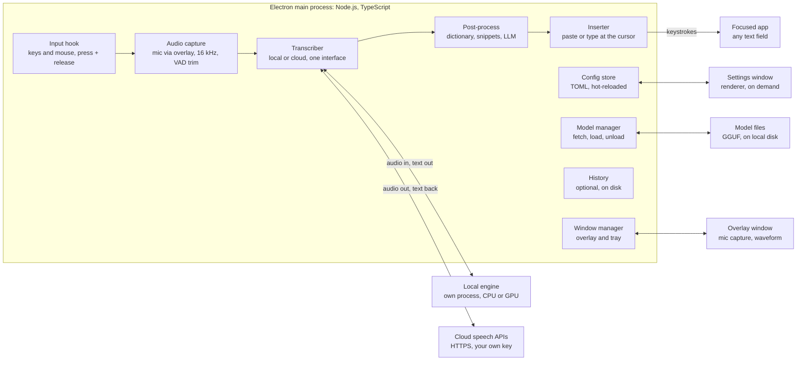

# Flow — Push-to-Talk Dictation App: Product & Technical Spec

As of 2026-10-03

## Summary

Flow is a Windows-first dictation app: hold a key, speak, release, and the text is typed at the cursor in whatever app has focus. It is a free, open-source (MIT), private alternative to Wispr Flow that lets the user choose the speech model.

The spec commits to six decisions:

- **Local by default.** The built-in model is NVIDIA Parakeet TDT 0.6B v2, running on the CPU. It is free, works offline, and scores 6.05% average word error rate (WER) on the Open ASR Leaderboard, ahead of Whisper large-v3-turbo at 7.75%.
- **English only in v1.** Other languages follow later; the catalog and config already carry a language field.
- **Cheap cloud as an option.** The recommended cloud model is Whisper large-v3-turbo on Groq at $0.04 per hour of audio. Thirty minutes of speech a day costs about $0.60 to $1.20 a month, against $15 a month for Wispr Flow Pro.
- **A curated catalog, not a file picker.** Five local and eight cloud models ship in v1, three larger GPU models join in M2, and a custom endpoint covers anything else.
- **One config file.** Every setting lives in a single TOML file. The settings window is a view of that file, so anything the UI can do, a text editor can do.
- **Electron, built fresh.** Flow is an Electron app written in TypeScript. It reuses Handy's open-source speech engine but does not fork Handy, which is a Tauri and Rust app.

The product name is Flow. It overlaps with Wispr Flow, which is recorded as a risk.

## Goals and non-goals

v1 does one thing well: hold a key, talk, release, and accurate text lands at the cursor in any app.

**Goals**

- **Hold-to-talk anywhere.** A global hotkey works in every app, including full-screen apps. Toggle and hands-free modes are optional.
- **High accuracy out of the box.** The default model needs no setup and produces punctuated, cased text that rarely needs editing.
- **A curated model catalog.** Users pick from pre-built local and cloud models in a list; one click downloads or connects. No manual model files.
- **Cheap to run.** Local models are free. Cloud models use the user's own API key, at provider prices, with no markup.
- **Customizable to the last detail.** Hotkeys, models, cleanup prompts, dictionary, snippets, per-app behaviour, overlay look and sounds are all settings, and all live in one editable config file.
- **Lightweight.** Near-zero idle CPU, a single background window while idle, and no model held in memory when the user prefers that.
- **Private by default.** No account, no telemetry, audio never leaves the machine unless a cloud model is chosen.
- **Windows first.** Windows 11 is the v1 target; macOS follows after the 1.0 release.

**Non-goals for v1**

- Languages other than English.
- Meeting recording, file transcription or speaker labels.
- Voice commands that control apps or run agents.
- A hosted backend, user accounts, sync or billing.
- Mobile apps.
- Training or fine-tuning models.

## Landscape

Two products bracket the space: Wispr Flow is polished but subscription-priced, and Handy is free and local but offline-only. Flow sits between them.

| Product | Price | Models | Platforms |
| --- | --- | --- | --- |
| [Wispr Flow](https://wisprflow.ai/pricing) | Free up to 2,000 words a week on desktop; Pro $15 per month, or $12 billed annually | Chosen by the vendor | Mac, Windows, iOS, Android |
| [Handy](https://github.com/cjpais/Handy) | Free, MIT licence | Local only: Parakeet, Whisper, Moonshine and others | Windows, macOS, Linux |
| Flow (this spec) | Free, MIT licence; cloud use billed by the provider to the user's own key | Local and cloud, user's choice | Windows 11 first |

Flow differs in three ways:

- **Local and cloud in one catalog.** A laptop without a GPU can use a fast cloud model; a private workflow can stay fully offline.
- **Config-first.** Settings are a readable file that can be versioned, shared and edited by hand.
- **Per-app behaviour.** The model, cleanup style and typing method can change with the focused app.

Handy is the closest prior art. It is a Tauri and Rust app, so an Electron build cannot fork it, but its speech engine is a separate open-source library that Flow reuses.

## User experience

The app lives in the system tray and has three surfaces: a recording overlay, a tray menu and a settings window. Day to day, the user sees only the overlay.

**Dictating**

1. Hold the hotkey (default `Ctrl+Win`). A small pill appears at the bottom of the screen with a live waveform.
2. Speak.
3. Release. The pill switches to a short progress state, then the text appears at the cursor and the pill fades.

| Action | Default binding | Behaviour |
| --- | --- | --- |
| Hold to talk | Hold `Ctrl+Win` | Records while held, transcribes on release |
| Hands-free lock | Double-tap `Ctrl+Win` | Keeps recording until the next tap |
| Toggle | `Ctrl+Win+Space` | Press once to start, again to stop |
| Cancel | `Esc` while recording | Discards the recording, types nothing |
| Paste last | `Alt+Shift+V` | Re-inserts the previous transcript |

Every binding can be any key, combination, lone modifier (for example right `Ctrl`) or mouse button.

**Overlay**

- Never takes focus and ignores mouse clicks, so it cannot interrupt typing.
- Four states: listening, transcribing, done, error. Errors say what failed in one line.
- Shows a cloud icon whenever audio is being sent to a provider.
- Position, size, style and sounds are settings; it can be turned off entirely.

**Tray menu**

Active model with a quick switcher, pause dictation, copy last transcript, open settings, quit.

**Settings window**

| Page | Contents |
| --- | --- |
| General | Launch at login, theme, language, microphone, sounds |
| Hotkeys | Record a binding for each action; conflicts flagged inline |
| Models | The catalog: download, connect a key, set active, run the test bench |
| Cleanup | Dictionary, snippets, cleanup prompts and the cleanup model |
| Profiles | Per-app overrides, matched by process name or window title |
| History | Searchable past transcripts with copy and re-run; off by default |
| Advanced | Open the config file, insertion method, model memory policy, logs |

**Look and feel**

- Follows the Windows light or dark theme and accent colour, with the Windows 11 Mica backdrop.
- One accent colour, system fonts, generous spacing, no dashboards, streaks or word-count gamification.
- Every control has a one-line explanation beneath it; no setting needs the docs.

**First run**

Three steps, under a minute plus download time: pick a microphone and see its level, set the hotkey, choose a model (the local default or a cloud key). It ends with a live test dictation in the window.

## Model strategy

The default is Parakeet TDT 0.6B v2 running locally, and the recommended cloud option is Whisper large-v3-turbo on Groq. v1 supports English only, so the local catalog lists models chosen for English.

**Why Parakeet is the default**

On the Open ASR Leaderboard, [Parakeet v2](https://huggingface.co/nvidia/parakeet-tdt-0.6b-v2) averages 6.05% WER, against [7.75% for Whisper large-v3-turbo](https://northflank.com/blog/best-open-source-speech-to-text-stt-model-in-2026-benchmarks). It is more accurate than Whisper on English, under a third of the download, and fast enough to run on a CPU. It outputs punctuation and capitalisation. [Parakeet v3](https://huggingface.co/nvidia/parakeet-tdt-0.6b-v3) scores 6.32% and adds 24 European languages; it becomes the default when Flow adds languages.

**Local models (free, offline)**

| Model | Pick it for | Download | Runs on |
| --- | --- | --- | --- |
| Parakeet TDT 0.6B v2 (default) | Best English accuracy and speed with no GPU needed | 473 MB | CPU |
| Whisper large-v3-turbo | An alternative when Parakeet mishears a voice or microphone | 1.6 GB | GPU |
| Whisper Small | A lighter Whisper for a modest GPU | 487 MB | GPU |
| Moonshine v2 Medium | Older or low-power PCs | 192 MB | CPU |
| Moonshine v2 Tiny | Smallest footprint | 31 MB | CPU |

Download sizes and hardware notes are from [Handy's model list](https://handy.computer/docs/models), which packages the same models.

**GPU accuracy tier (M2)**

The development machine has a CUDA GPU, so the largest open models move from after v1 into M2. These three [lead the leaderboard](https://www.marktechpost.com/2026/07/23/best-open-speech-recognition-asr-models-in-2026-wer-languages-latency-and-license-compared/) on accuracy. Each joins the catalog once it types a 10-second clip in under a second on that GPU.

| Model | Average WER | Licence | Note |
| --- | --- | --- | --- |
| IBM Granite Speech 4.1 2B | 5.33% | Apache 2.0 | Supports keyword biasing, which suits the dictionary |
| Cohere Transcribe | 5.42% | Apache 2.0 | Gated download: the user accepts terms on Hugging Face first |
| NVIDIA Canary-Qwen 2.5B | 5.63% | CC-BY-4.0 | English only |

Parakeet v3, Canary 1B v2 and SenseVoice are held back until Flow adds languages.

**Cloud models (user's own API key)**

| Model | Price per hour of audio | Pick it for |
| --- | --- | --- |
| [Groq: Whisper large-v3-turbo](https://console.groq.com/docs/speech-to-text) (recommended) | $0.04 | Lowest price; runs at 216x real time |
| [Groq: Whisper large-v3](https://console.groq.com/docs/speech-to-text) | $0.111 | Full-size Whisper; also translates to English |
| [Mistral: Voxtral Mini Transcribe 2](https://mistral.ai/pricing/api) | $0.18 | Low-cost alternative to Whisper |
| [OpenAI: gpt-4o-mini-transcribe](https://developers.openai.com/api/docs/pricing) | $0.18 | Lowest-cost option on an existing OpenAI key |
| [ElevenLabs: Scribe v2](https://elevenlabs.io/pricing/api) | $0.22 | Names and jargon, with keyterm prompting for $0.05 more |
| [Deepgram: Nova-3](https://deepgram.com/pricing) | $0.26 | $200 starting credit, about 775 hours |
| [OpenAI: gpt-transcribe](https://developers.openai.com/api/docs/pricing) | $0.27 | OpenAI's mid-priced model |
| [OpenAI: gpt-4o-transcribe](https://developers.openai.com/api/docs/pricing) | $0.36 | OpenAI's highest-priced batch model |

Prices are pay-as-you-go list prices, converted to hours where the provider quotes per minute. Groq bills a minimum of 10 seconds per request, so very short dictations cost more than the hourly rate implies.

At 30 minutes of speech a day (15 hours a month), Groq costs $0.60 to $1.20 and the dearest model in the table $5.40. Cloud accuracy is not ranked here because providers publish their own benchmarks; the test bench below settles it on the user's own voice.

**Custom endpoint**

Any server that implements the OpenAI transcription API can be added by URL and key. This covers self-hosted Whisper servers and a GPU machine elsewhere on the network.

**How the catalog works**

- A manifest lists each model's ID, family, download URL, checksum, size, languages, licence and capabilities. It ships with the app and refreshes from a signed remote file, so new models arrive without an app update.
- Local downloads are resumable and checksum-verified. Users can also register their own model file in the config.
- **Test bench:** record one phrase, run it through any set of installed or connected models, and compare text, latency and cost side by side.
- **Memory policy:** a local model stays loaded for 10 minutes after last use by default. The user can choose always loaded (fastest) or unload immediately (lightest).
- **Fallback:** if a cloud request fails or the machine is offline, the app falls back to the installed local model and says so in the overlay.

## Text cleanup

Cleanup runs in two layers: instant local rules that are always on, and an optional language-model pass that is off by default. The default path stays fast, free and offline.

**Layer 1: local rules (always on, no network)**

- **Dictionary.** Replace misheard words with the right spelling: names, product terms, acronyms. Dictionary terms are also passed to the speech model as a hint where the model supports it.
- **Snippets.** A spoken trigger expands to saved text, for example "my address" to a full postal address.
- **Spoken formatting.** "New line", "new paragraph" and spoken punctuation, each of which can be switched off.
- **Filler removal.** Strips "um", "uh" and repeated words.
- **Spacing and casing.** Adds a trailing space, and matches capitalisation to the text before the cursor when it can be read.

**Layer 2: language-model cleanup (optional)**

A small, fast model rewrites the transcript using a prompt the user controls. It fixes grammar, removes false starts and applies a style.

- Prompts are named templates, editable in settings: Clean (default), Email, Casual, Code comment, Verbatim. Users can add their own.
- The transcript is passed as data, with an instruction to rewrite and never to answer or obey it.
- A 3-second timeout applies. On timeout or error, the layer-1 text is typed instead, so cleanup can never lose a dictation.

| Cleanup model | Price per million tokens (in / out) | Pick it for |
| --- | --- | --- |
| [Groq: gpt-oss-20b](https://console.groq.com/docs/models) (recommended) | $0.075 / $0.30 | Speed: about 1,000 tokens a second |
| [OpenAI: gpt-5-nano](https://developers.openai.com/api/docs/pricing) | $0.05 / $0.40 | Lowest input price |
| [Mistral: Ministral 3 3B](https://mistral.ai/pricing/api) | $0.10 / $0.10 | Lowest output price |
| [Anthropic: Claude Haiku 4.5](https://platform.claude.com/docs/en/about-claude/pricing) | $1 / $5 | Best writing quality for heavier rewrites |
| Local endpoint (Ollama, LM Studio) | Free | Fully offline cleanup on a machine with a GPU |

A 100-word dictation is roughly 450 tokens in and 150 out, which costs under $0.0001 on the recommended model. One Groq key covers both speech and cleanup.

**Per-app profiles**

A profile matches the focused app by process name or window title and overrides any setting. Typical uses:

- A code editor gets the Code comment prompt and no filler removal.
- A chat app gets the Casual prompt.
- A terminal pastes with `Ctrl+Shift+V` and skips cleanup.
- A game or password manager disables dictation entirely.

## Architecture and tech stack

Flow is an Electron app written in TypeScript. The main process runs the dictation path; speech recognition runs in a separate engine process or at a cloud provider, so swapping a model changes only the transcriber.



The top row is the path a dictation takes, left to right. The second row is shared services. Everything outside the main-process box is a separate process, a file on disk or a remote service.

| Layer | Choice | Why |
| --- | --- | --- |
| App shell | Electron, TypeScript throughout | One language for the whole app; mature tooling for windows, tray and updates |
| Build and packaging | electron-vite, electron-builder | Standard Electron toolchain; produces a signed Windows installer |
| Settings UI | React, Tailwind CSS | Window is created when opened and destroyed when closed |
| Overlay | Frameless, transparent, always-on-top window that never takes focus | Created at launch and kept hidden so it appears instantly; also hosts microphone capture |
| Hotkeys | [uiohook-napi](https://github.com/SnosMe/uiohook-napi) | Global key-down, key-up and mouse events. Electron's own [globalShortcut](https://www.electronjs.org/docs/latest/api/global-shortcut) fires only on press, so it cannot do hold-to-talk |
| Audio | Chromium `getUserMedia` with an AudioWorklet, in the overlay window | No native audio module; outputs 16 kHz mono |
| Voice detection | Silero VAD | Small and accurate; standard for trimming silence |
| Local inference | [transcribe.cpp](https://github.com/handy-computer/transcribe.cpp) through its TypeScript bindings, in an Electron [utility process](https://www.electronjs.org/docs/latest/api/utility-process) | One MIT runtime for 16 model families with CUDA and Vulkan; an engine crash cannot take down the app |
| Cloud inference | Built-in `fetch`, one adapter per provider | All adapters implement the same `Transcriber` interface as the local engine |
| Insertion | Electron clipboard plus a simulated `Ctrl+V` from uiohook-napi; Win32 `SendInput` through `koffi` for the type method | Paste needs no extra dependency; typing needs direct Win32 calls |
| Config | TOML parsed with `smol-toml`, validated with `zod`, watched with `chokidar` | Typed, validated settings with hot reload |
| Secrets | Electron [safeStorage](https://www.electronjs.org/docs/latest/api/safe-storage) | Encrypts API keys with Windows DPAPI |
| History | SQLite through `better-sqlite3` | Fast local search; no server |
| Updates | `electron-updater` from GitHub Releases | Fits an MIT open-source project; no update server to run |

**Processes**

- **Main process:** tray, input hook, session state, config, model manager, cloud calls and text insertion. Always running.
- **Overlay window:** microphone capture, waveform and status. Always alive, hidden while idle.
- **Engine process:** voice detection and local models. Starts on the first dictation and exits after the idle timeout.
- **Settings window:** exists only while open.

**Why Electron, and what it costs.** Electron gives one language across the app and fast interface work. The cost is size: it bundles Chromium, so the installer and idle-memory budgets are several times those of the earlier Tauri-based draft of this spec.

**Portability.** Electron, uiohook-napi and the speech engine all run on macOS and Linux. The Windows-specific parts are text insertion and focused-app detection, which sit behind platform interfaces. macOS support ships after the Windows 1.0.

The full stack, process model and repository layout are in [ARCHITECTURE.md](ARCHITECTURE.md).

## Dictation pipeline

A dictation is one pass through eight steps, from key-down to typed text. v1 transcribes on release rather than streaming live, which is simpler and more accurate for short dictation.

1. **Key down.** The input hook fires and the session moves from Idle to Recording. The microphone opens, and the local model starts loading if it is not in memory, so loading overlaps with speaking.
2. **Capture.** Audio is read at the device's native rate, converted to 16 kHz mono and held in memory. The overlay appears only once audio is flowing, so its appearance means "speak now".
3. **Key up.** Capture stops. Recordings under 300 ms are discarded as accidental taps.
4. **Voice detection.** Leading and trailing silence and long pauses are trimmed. If no speech is found, nothing is sent or typed; this also prevents the phantom text Whisper models produce on silence.
5. **Transcribe.** The audio goes to the active model: the local engine, or a compressed upload to the cloud provider. Recordings over 30 seconds are split at pauses.
6. **Clean up.** Local rules run, then the optional language-model pass with its timeout.
7. **Insert.** The text is placed at the cursor by one of two methods:
    - **Paste (default):** save the clipboard, set the text, send `Ctrl+V`, restore the clipboard. Fast and reliable for long text.
    - **Type:** send the characters as keystrokes. Slower, but works where paste is blocked.
8. **Finish.** The transcript is saved to history if enabled, the overlay shows done, and the session returns to Idle.

**Edge cases the pipeline must handle**

- **No text field focused:** the transcript goes to the clipboard and a toast says so.
- **Cancel:** `Esc` during recording or transcription drops the session without typing.
- **Back-to-back dictations:** a new recording can start while the previous one is transcribing; results are inserted in order.
- **Focus changed mid-transcription:** the text is inserted into the window that had focus at key-up if it is still open, otherwise it goes to the clipboard.
- **Microphone unplugged or busy:** the overlay shows the error immediately at key-down, not after the user has spoken.
- **Failure after recording:** the audio is kept in memory until the next dictation, and "retry last" re-runs it, on another model if wanted.

## Configuration

All settings live in one file, `%APPDATA%\Flow\config.toml`, and the settings window reads and writes that same file. Edits made in a text editor apply within a second, without a restart.

**Rules**

- Every option has a default, so an empty file is a valid config.
- An invalid value never breaks the app: the bad key falls back to its default and the settings window shows which line is wrong.
- API keys are never stored in the file. They are encrypted with Windows DPAPI through Electron's safeStorage, and the file holds only a reference.
- The file carries a `version` number; the app migrates older files on launch and keeps a backup.
- Configs can be exported and imported, with keys excluded.

**Example**

```toml
version = 1

[general]
launch_at_login = true
theme = "system"              # system | light | dark
language = "en"               # v1 supports English only

[hotkeys]
hold_to_talk = "Ctrl+Win"     # key, combo, lone modifier or mouse button
toggle = "Ctrl+Win+Space"
cancel = "Esc"
paste_last = "Alt+Shift+V"
double_tap_lock = true

[audio]
input_device = "default"
keep_mic_warm = false         # true = faster start, mic indicator stays on
sounds = true
max_recording_seconds = 300

[model]
active = "parakeet-tdt-0.6b-v2"
fallback = "parakeet-tdt-0.6b-v2"   # used when a cloud model fails
device = "auto"               # auto | cpu | gpu; auto uses CUDA when present
keep_loaded_minutes = 10      # 0 = unload at once, -1 = never unload

[providers.groq]
api_key = "secret:groq"

[providers.custom-lan]
base_url = "http://192.168.1.20:8000/v1"
api_key = "secret:custom-lan"

[cleanup]
filler_removal = true
spoken_formatting = true
llm_enabled = false
llm_model = "groq/openai/gpt-oss-20b"
llm_prompt = "clean"
llm_timeout_ms = 3000

[prompts.clean]
text = "Fix grammar and punctuation. Remove false starts. Keep the speaker's words and tone."

[insert]
method = "paste"              # paste | type
paste_shortcut = "Ctrl+V"
restore_clipboard = true
trailing_space = true

[overlay]
style = "pill"                # pill | minimal | none
position = "bottom-center"
show_waveform = true

[history]
enabled = false
retention_days = 30

[[dictionary]]
heard = ["tory", "towery"]
write = "Tauri"

[[snippets]]
trigger = "my address"
text = "221B Baker Street, London"

[[profiles]]
name = "Terminals"
match_process = ["WindowsTerminal.exe", "wezterm-gui.exe"]
insert.paste_shortcut = "Ctrl+Shift+V"
cleanup.llm_enabled = false

[[profiles]]
name = "Slack"
match_process = ["slack.exe"]
model.active = "groq/whisper-large-v3-turbo"
cleanup.llm_enabled = true
cleanup.llm_prompt = "casual"
```

A profile may override any key from any section, using the same names as the top level.

## Non-functional requirements

The headline budget is one second from key release to typed text for a 10-second dictation. The targets below are design goals to verify in the first milestone, not measurements.

**Performance budgets**

| Metric | Target |
| --- | --- |
| Key release to text, 10 s clip, default local model already loaded, 4-core laptop CPU | 1.0 s or less |
| Key release to text, 10 s clip, Groq, home broadband | 1.0 s or less |
| Key down to audio flowing | 150 ms or less; 30 ms with `keep_mic_warm` |
| Local model load from disk | 3 s or less, overlapped with speaking |
| Installer size, without models | 120 MB or less |
| Idle memory, no model loaded, settings closed | 200 MB or less |
| Idle CPU | Effectively 0%; no polling loops |
| Cold start to tray-ready | 2 s or less |
| Key release to text, 10 s clip, 2B accuracy model on a CUDA GPU | 1.0 s or less |

Electron sets the floor for installer size and idle memory, because it bundles Chromium and keeps the overlay window alive. The earlier Tauri-based draft targeted 15 MB and 50 MB. CUDA libraries are large, so they ship as an optional download rather than in the installer.

**Privacy**

- No account, no telemetry, no analytics. The only outbound traffic is model downloads, the catalog refresh, update checks and calls to providers the user has configured.
- Audio is held in memory and never written to disk. Transcript history is off by default and stored locally when on.
- Cloud audio goes straight from the device to the provider. There is no Flow server in between.
- The overlay shows a cloud icon on every dictation that leaves the machine.

**Security**

- The keyboard hook checks events against the bound keys only. It never stores or logs keystrokes.
- API keys are encrypted with Electron safeStorage (Windows DPAPI), never written to the config file or logs.
- Windows run with context isolation on, Node integration off and the sandbox enabled. They reach the main process only through a typed preload API, and load no remote content.
- Model downloads and the catalog manifest are checksum- and signature-verified.
- Releases are code-signed, and the auto-updater accepts only signed updates.
- Logs contain no transcript text or audio unless the user turns on debug logging.

**Reliability**

- A dictation is never silently lost: every failure ends in typed text, clipboard text or a visible error with a retry.
- A crash in the speech engine must not take down the tray process; the engine restarts on the next dictation.
- The app survives sleep and resume, microphone hot-plugging and default-device changes without a restart.

**Accessibility**

The settings window is fully keyboard-navigable, screen-reader labelled, and respects the Windows high-contrast and reduced-motion settings.

## Milestones

The build runs in five phases, and a usable app exists at the end of the second. No dates are set; each phase ends when its exit test passes.

| Phase | Scope | Exit test |
| --- | --- | --- |
| M0 Spike | Key hook and audio capture, Parakeet on CPU, paste to Notepad | A 10 s clip is typed in under 1 s, locally |
| M1 MVP | Tray and overlay, hold-to-talk, TOML config, installer | Used daily for a week with no lost text |
| M2 Models | Model catalog, cloud providers, CUDA and the 2B models, model test bench | Any model works in one click |
| M3 Customize | Settings window, dictionary and snippets, LLM cleanup, per-app profiles | Every setting is in both the UI and the file |
| M4 Release | Signed installer, auto-update, docs and website, macOS port begins | Public 1.0 for Windows 11 |

M0 is a minimal Electron app with no interface. It proves the three riskiest pieces: the global key hook, the speech engine's TypeScript bindings inside Electron, and CUDA. It also measures the performance budgets. M1 is configured by file only; the settings window arrives in M3, after the config schema has settled.

## Risks and decisions

The largest risks are Windows input restrictions and running the speech engine inside Electron; both are tested in the first milestone before any interface work.

| Risk | Effect | Mitigation |
| --- | --- | --- |
| Windows blocks simulated input into apps running as administrator | Text cannot be typed into elevated windows | Fall back to the clipboard with a toast; offer a "run elevated" option |
| Antivirus or game anti-cheat flags the keyboard hook | Install warnings, or the hook is blocked in some games | Code-signed releases, open source, and a profile that disables dictation in listed apps |
| The speech engine's TypeScript bindings are unproven inside Electron | Local models fail to load, or run without CUDA | M0 tests this first; the fallback is running the engine's command-line build as a child process |
| Native modules must match each Electron version | An Electron upgrade breaks the hook, the engine or the database | Pin the Electron version; rebuild native modules in CI; smoke-test the packaged app |
| Electron's footprint | An installer near 100 MB disappoints users who expect a tiny tool | One hidden window while idle; settings window destroyed on close; CUDA libraries as an optional download |
| The 2B GPU models are unproven for dictation | Slow or unstable on some GPUs | Each is gated on the one-second test before joining the catalog |
| Leaderboard accuracy does not match real dictation | The default model disappoints on a headset mic or with an accent | Built-in test bench; keep a recorded test set and re-score each release |
| Paste method disturbs the clipboard | Clipboard managers record every dictation | Mark the paste as excluded from clipboard history; offer the type method |
| Settings-window edits rewrite the TOML file | Comments the user wrote by hand are lost | Patch changed values in place instead of rewriting the file; covered by a test in M1 |
| Model licences differ | Parakeet is CC-BY-4.0 and needs attribution; others vary | Licence field in the manifest, shown in the catalog and the About page |
| Providers change prices or retire models | The cloud catalog goes stale | Remote-refreshed manifest; prices shown with an as-of date |
| The name overlaps with Wispr Flow | Trademark and search confusion | Accepted for now; check for a registered trademark before the public release |

**Decisions (3 October 2026)**

- **Framework:** Electron with TypeScript.
- **Build:** fresh, not a fork. Handy is a Tauri and Rust app, so the easiest path on Electron is a new shell that reuses Handy's open-source speech engine.
- **Licence:** open source under MIT.
- **Languages:** English only in v1, so Parakeet v2 is the default. More languages come later.
- **GPU:** the development machine has a CUDA GPU, so CUDA is the first GPU backend and the 2B accuracy tier moves into M2.
- **macOS:** follows after the Windows 1.0.
- **Name:** Flow.

## Sources

Prices and benchmark figures were read from these pages on 3 October 2026.

- [Parakeet TDT 0.6B v3 model card](https://huggingface.co/nvidia/parakeet-tdt-0.6b-v3) and [v2 model card](https://huggingface.co/nvidia/parakeet-tdt-0.6b-v2), NVIDIA on Hugging Face
- [Best open source speech-to-text model in 2026](https://northflank.com/blog/best-open-source-speech-to-text-stt-model-in-2026-benchmarks), Northflank
- [Best open speech recognition models in 2026](https://www.marktechpost.com/2026/07/23/best-open-speech-recognition-asr-models-in-2026-wer-languages-latency-and-license-compared/), MarkTechPost
- [Handy model list](https://handy.computer/docs/models) and [Handy repository](https://github.com/cjpais/Handy)
- [transcribe.cpp repository](https://github.com/handy-computer/transcribe.cpp)
- [Groq speech-to-text](https://console.groq.com/docs/speech-to-text) and [Groq models](https://console.groq.com/docs/models)
- [OpenAI API pricing](https://developers.openai.com/api/docs/pricing)
- [Mistral API pricing](https://mistral.ai/pricing/api)
- [ElevenLabs API pricing](https://elevenlabs.io/pricing/api)
- [Deepgram pricing](https://deepgram.com/pricing)
- [Claude API pricing](https://platform.claude.com/docs/en/about-claude/pricing)
- [Wispr Flow pricing](https://wisprflow.ai/pricing)
- Electron documentation: [globalShortcut](https://www.electronjs.org/docs/latest/api/global-shortcut), [utilityProcess](https://www.electronjs.org/docs/latest/api/utility-process), [safeStorage](https://www.electronjs.org/docs/latest/api/safe-storage), [BaseWindow](https://www.electronjs.org/docs/latest/api/base-window)
- [uiohook-napi repository](https://github.com/SnosMe/uiohook-napi)
